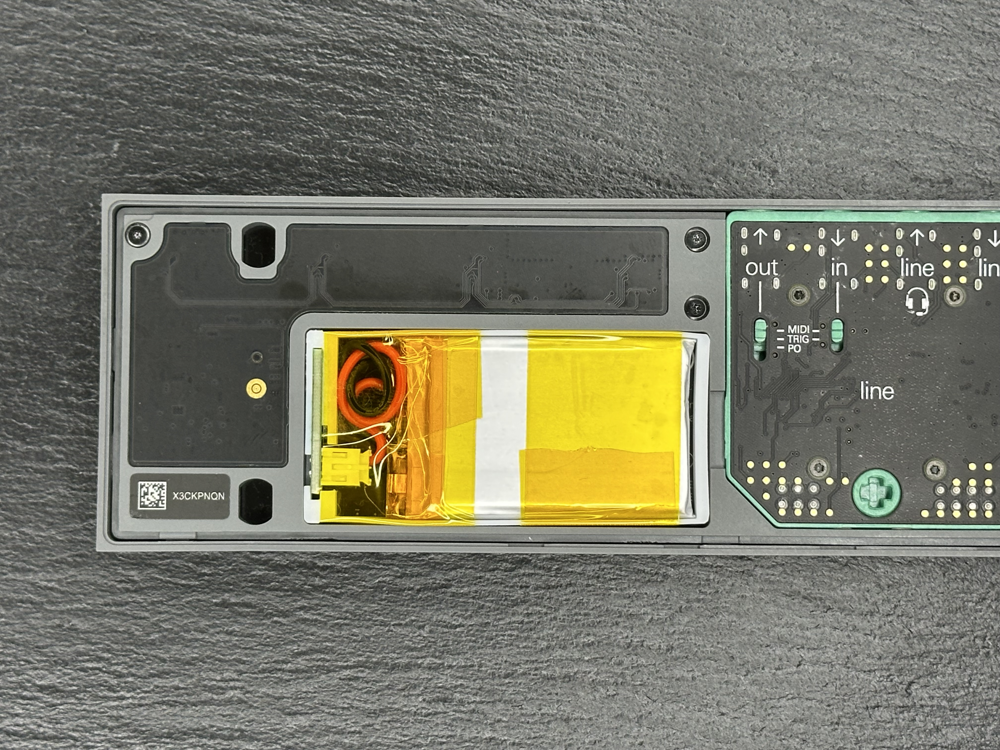
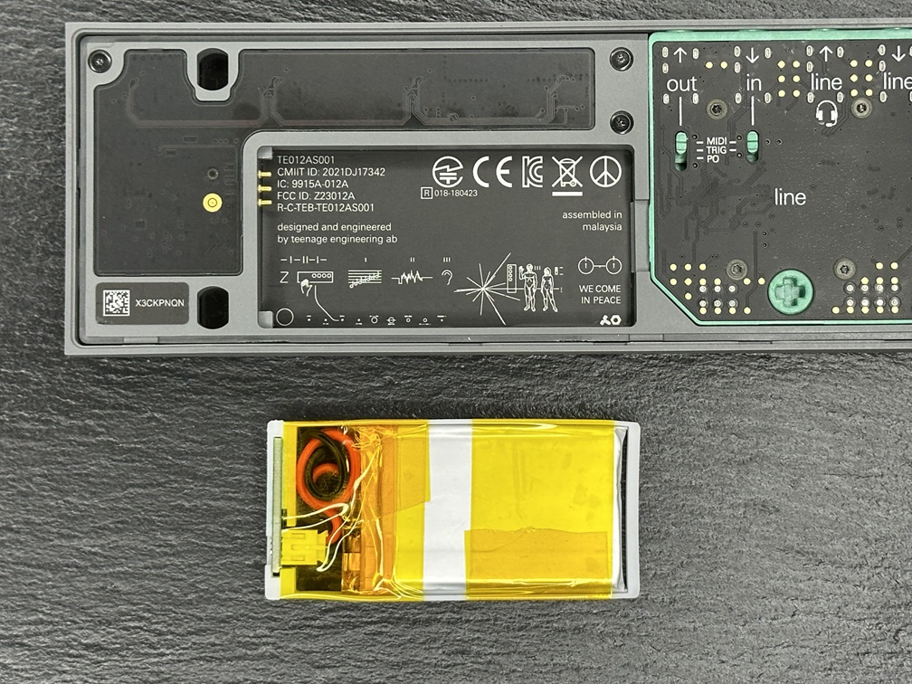
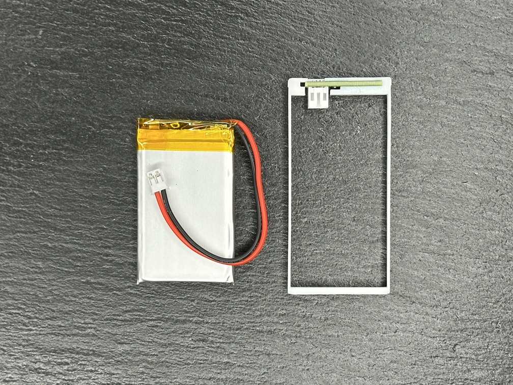

# OP-Z-Replacement-Battery
The files for a Frame and PCB that adapt LiPo battery for the OP-Z

With the Frame and the PCB you can plug in any 3.7V LiPo with a PH2.0 that will fit. The largest battery I found that can fit is a 503048, this turned out to be a 800mAh

